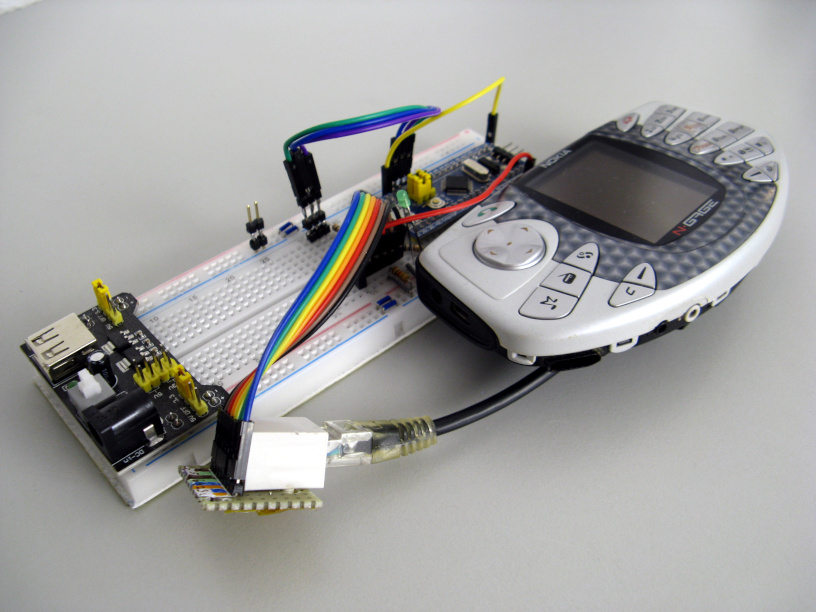
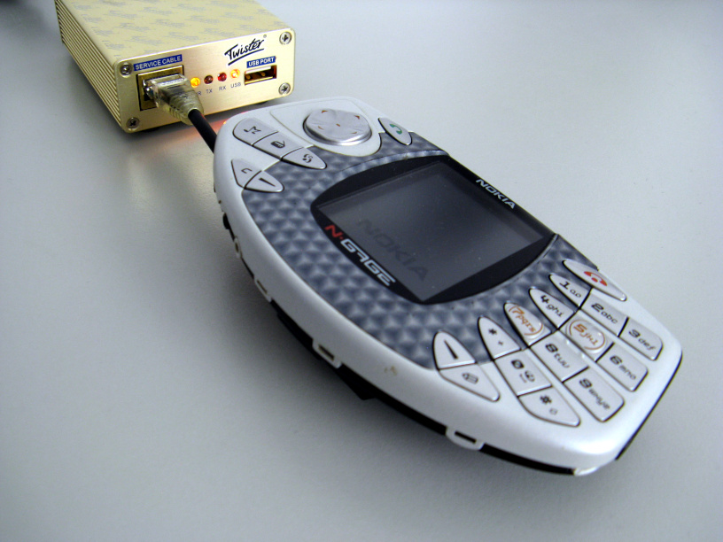
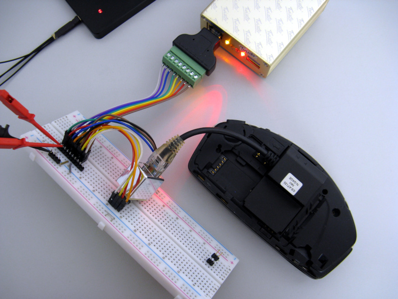

# WSODFix

<p>
<a href="https://github.com/mupfelofen-de/WSODFix">
    
</a>
<a href="https://github.com/mupfelofen-de/WSODFix/blob/master/LICENSE.md">
    
</a>
<a href="https://www.travis-ci.com/mupfelofen-de/WSODFix">
    
</a>
<a href="https://www.codacy.com/manual/mupf/eszFW?utm_source=github.com&amp;utm_medium=referral&amp;utm_content=mupfelofen-de/eszFW&amp;utm_campaign=Badge_Grade">
    
</a>
</p>

## About

[](https://app.codacy.com/gh/mupfelofen-de/WSODFix?utm_source=github.com&utm_medium=referral&utm_content=mupfelofen-de/WSODFix&utm_campaign=Badge_Grade_Settings)
[](.media/wsodfix.jpg?raw=true "WSODFix")

Nokia mobile phones such as the N-Gage running early versions of the
Symbian OS suffer from a very common problem widely known as the White
Screen of Death or simply WSOD.  This happens when the internal memory
of the phone becomes so full that the unit can no longer boot and
becomes virtually unusable.

To solve this, the memory, referred to here as the user area, must be
formatted.

However, professional flashing equipment is needed to achieve this and
nowadays it is hard to find such equipment for sale.  More than often,
manufacturers, which cloned official service hardware, sold it in
addition to hardware licences in the form of a dongle.  Also, as new
devices would come out, old ones would literally be rendered unusable by
the manufacturers via the internet or sometimes by malware-infected
software released by competitors.

[](.media/twister.jpg?raw=true "Twister")

There is official software with which some of these devices can be
repaired and reactivated with, but access to reliable information is
anything but trivial.

This project is not an alternative to professional flashing equipment,
but aims at offering the possibility to make older Symbian phones
affected by a simple WSOD usable again by leveraging open-source
software and DIY hardware.

The project is based on a STM32F103C8 microcontroller board a.k.a. a
[blue pill board](http://reblag.dk/stm32/).

## Status

### Firmware

The firmware is 100% functional.

### Compatible phones

WSODFix has been tested with the following phones so far:

-   Nokia N-Gage (NEM-4)

-   Nokia N-Gage QD (RH-29)

## Operating instructions

Important: Never use WSODFix with a working phone! If the formatting
fails or is interrupted in the process, the device may no longer
boot. This can then only be repaired by a successful run.

1.  Connect the UFS flashing cable to your phone.  It is very important
    to follow the correct insertion and removal procedure, otherwise the
    contact pins on the flash adapter will be damaged.  For the N-Gage
    and N-Gage QD, you must first press the adapter against the battery
    contacts and then down.

2.  Attach the cable to the RJ45 connector of your WSODFix.

3.  Connect the USB cable. Make sure that the USB port used can supply
    sufficient power for the phone and the microcontroller.

4.  First, the LED should flash for about 20 seconds at a rate of 1
    second.  This is when the phone enters service mode.

5.  Wait until the formatting process begins. The LED then flashes at a
    rate of 30ms.

6.  The process is completed when the LED lights up continuously. You
    can then disconnect the phone and try to turn it on.  If the
    procedure fails, try again from the beginning.

## Hardware

### Parts needed

-  UFS flashing cable or any way to connect the microcontroller to the
   corresponding pins on the phone (for example see the [N-Gage cable
   schematics](docs/Nokia_N-Gage_cable.pdf)),

-  [STM32 blue pill board](http://reblag.dk/stm32/)

-  RJ45 Ethernet jack,

-  [RJ45 Breakout](https://www.sparkfun.com/products/716),

-  1× 1kΩ and 1× 10kΩ resistor (optional),

-  1× External status LED + dropping resistor (optional).

### Wiring diagram

Note: The voltage divider is almost certainly optional.  Alternatively,
you can also set Vpp to 3V3.

[](.media/schematic.svg?raw=true "Schematic")

## FBus

The FBus is a bi-directional full-duplex serial type bus running at
115,200 bit/s, 8 data bits, no parity, one stop bit (8N1).

### Message structure

```text
  [      Header     ] [Payload] [xx xx]
  [1E xx xx xx xx xx] [Payload] [ CRC ]

  [ Header ]
  Byte 0 - F-Bus Frame ID
    E1 = Message via F-Bus cable
  Byte 1 - Destination address
  Byte 2 - Source address
    00 = Phone
    10 = Twister
  Byte 3 - Message type / command
    15 = Handshake/Auth ?
    7F = Acknowledge
    58 = Format user area
  Byte 4 - Payload size in bytes (MSB)
  Byte 5 - Payload size in bytes (LSB)

  [ Payload ]
  Byte 6 ... - Payload

  [ CRC ]
  Byte 1 - even checksum byte (all even bytes XORed together)
  Byte 2 - odd checksum byte  (all odd bytes XORed together)
```

### Formatting the user area

Here is a brief summary of the messages exchanged between the flashing
equipment and the Symbian phone when the user area is formatted.

[](.media/logic-analyser.jpg?raw=true "Logic analyser")

This description is based on pure observation with the help of a logic
analyser.

```text
SEND 55 55 55 55 55 55 (synchronisation)

ca. 60ms pause

SEND [1E 00 10 15 00 08] [00 06 00 02 00 00 01 60]   [0F 79]
RECV [1E 10 00 7F 00 02] [15 00]                     [0B 6D]
RECV [1E 10 00 15 00 08] [06 27 00 65 05 05 01 (42)] [1C 08]
SEND [1E 00 10 7F 00 02] [15 (02)]                   [1B 7F]

ca. 16ms pause

SEND [1E 00 10 58 00 08] [00 0B 00 07 06 00 01 41]   [09 1D]
RECV [1E 10 00 7F 00 02] [58 01]                     [46 6C]

ca. 40-50s pause

RECV 55 55 (synchronisation)
RECV [1E 10 00 58 00 08] [0B 38 00 08 00 00 01 (43)] [14 33]

SEND [1E 00 10 7F 00 02] [58 (03)]                   [56 7E]
```

Surely you have noticed the parenthesised numbers.  These vary from run
to run.  The Symbian phone sends an initial value between 0x40 and 0x47.
The flashing equipment responds with this number minus 0x40.

Moreover, this number is apparently a kind of frame counter.  For
example, if the phone sends an initial 0x42, the next message sent from
the phone to the flasher will contain the number 0x43.  After 0x47,
there is an overflow back to 0x40.

This frame counter is implemented in WSODFix, but I do not know if it is
mandatory.  The rest of the payload data is completely ignored.  The
firmware only checks the message type of the received FBus messages.  In
my tests, this was 100% reliable.

Unfortunately FBus is a proprietary protocol developed by Nokia.  If you
have detailed specifications that you would like to share with me, I
would greatly appreciate it.  This would also help the further
development of this project.

## Installation

1. Install [PlatformIO Core](http://docs.platformio.org/page/core.html)
2. Run these commands:

```bash
    # Build project
    > platformio run

    # Upload firmware
    > platformio run --target upload

    # Clean build files (optional)
    > platformio run --target clean
```

## Licence

This project is licensed under the "The MIT License".  See the file
[LICENSE.md](LICENSE.md) for details.
